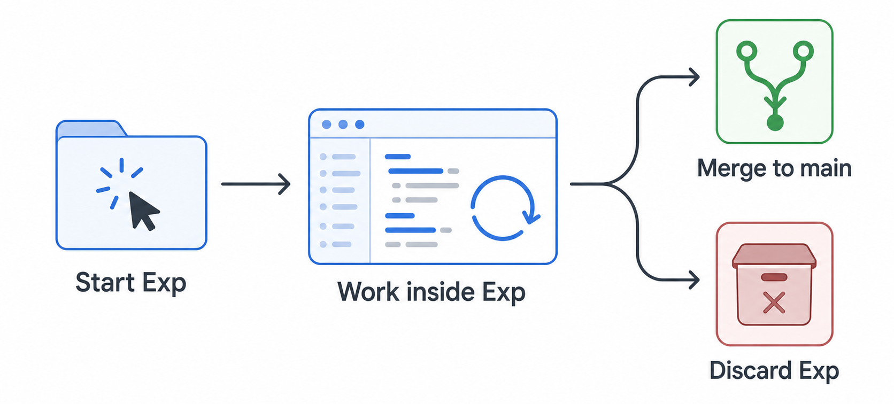

# ForkRoom

ForkRoom is a replacement for traditional worktrees that helps you run multiple coding ideas in isolated workspaces, fully in parallel and without tears.
When you start a new experiment, it keeps code changes, plans, runs, outputs, and logs together so every trial has one place to live.
It is a minimal implementation of an AI-native coding ecosystem: you keep full control of everything and can use any coding agent you like, including Codex, Claude Code, and others.

## Install

1. Open your project directory.
2. Run one command:

```bash
uvx --from git+https://github.com/siyryu/forkroom.git forkroom install
```

This installs the `forkroom` CLI and the ForkRoom skills for the current project.

## Usage

Open the repo where you want to start coding, then use the `@forkroom` skill and ask it to help you start your first experiment.



### Concepts

| Concept | What it means | Where it lives |
| --- | --- | --- |
| Exp (Experiment) | One isolated attempt to explore a coding idea. It owns the branch, worktree, manifest, outputs, logs, sessions, and runs for that trial. | `.forkroom/exps/<exp-id>/` |
| Session | One agent conversation or thread working on an experiment. Multiple sessions can attach to the same experiment. | `sessions[]` in `.forkroom/exps/<exp-id>/manifest.json` |
| Run | One tracked long-running task inside a session, with status, progress counts, messages, ETA, and events. A session can have only one active run at a time. | `.forkroom/exps/<exp-id>/runs/<run-id>.json` |

### Create an experiment

Ask your coding agent to use `@forkroom` to create a ForkRoom experiment for the coding task you want to explore.

The skill creates `.forkroom/exps/my-experiment/worktree`, a `forkroom/my-experiment` branch, and a manifest that keeps the experiment together.

### Continue an experiment in another session

From the ForkRoom interface, copy the experiment info into a new agent session and ask that agent to continue the experiment with `@forkroom`.

The skill binds the new session to the existing experiment, then keeps work inside `.forkroom/exps/my-experiment/worktree`.

### Merge an experiment

When an experiment is ready, ask your coding agent to use `@forkroom` to merge experiment `my-experiment` back to `main`.

ForkRoom's merge flow selectively ports the finished code into the main worktree instead of blindly merging the experiment branch. The experiment also gets a `.forkroom/exps/my-experiment/handoff.md` file with the commit ID, merged files, and any follow-up notes.

## Contribute

Clone ForkRoom and install the local CLI in editable mode:

```bash
FORKROOM_REPO="$HOME/Developer/forkroom"

git clone https://github.com/siyryu/forkroom.git "$FORKROOM_REPO"
cd "$FORKROOM_REPO"
uv tool install --force --editable .
```

Link the local skills into a project you use for testing:

```bash
forkroom install --root /path/to/your-project --source . --link-skills --no-tool-install
```

Run the tests before sending changes:

```bash
uv run --with pytest python -m pytest
```
